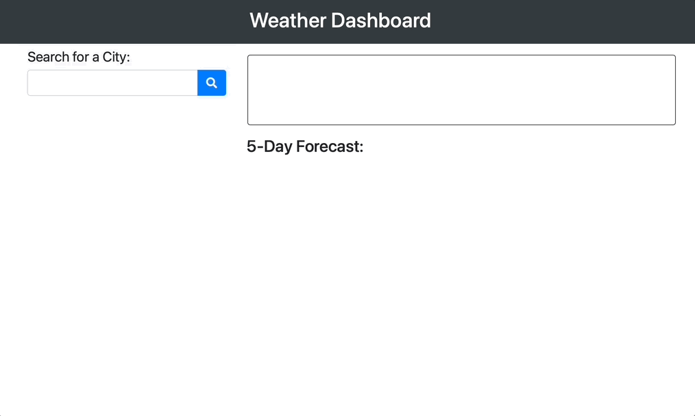

# weather-dashboard
For this homework assignment, we had to create a weather dashboard. The user is asked to enter a city in the search bar. When they press the button, the city is then saved underneath the search bar in the history and that city's weather information (temperature, humidity, wind speed, and UV index) appears for today's date. We had to get the weather information for an API, using an API key. The next 5 day forecast is also shown at the bottom in 5 different blocks.

## Technologies Used
HTML/CSS and Javascript, using Bootstrap and Moment.js on Visual Studio

## Application Functioning

Final website found here: [Weather Dashboard](https://samyuhan.github.io/weather-dashboard/)